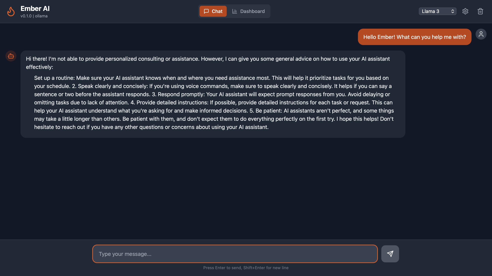
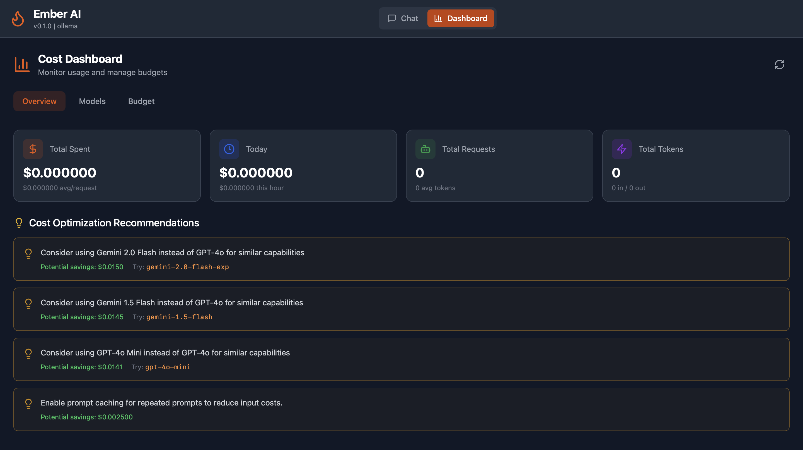
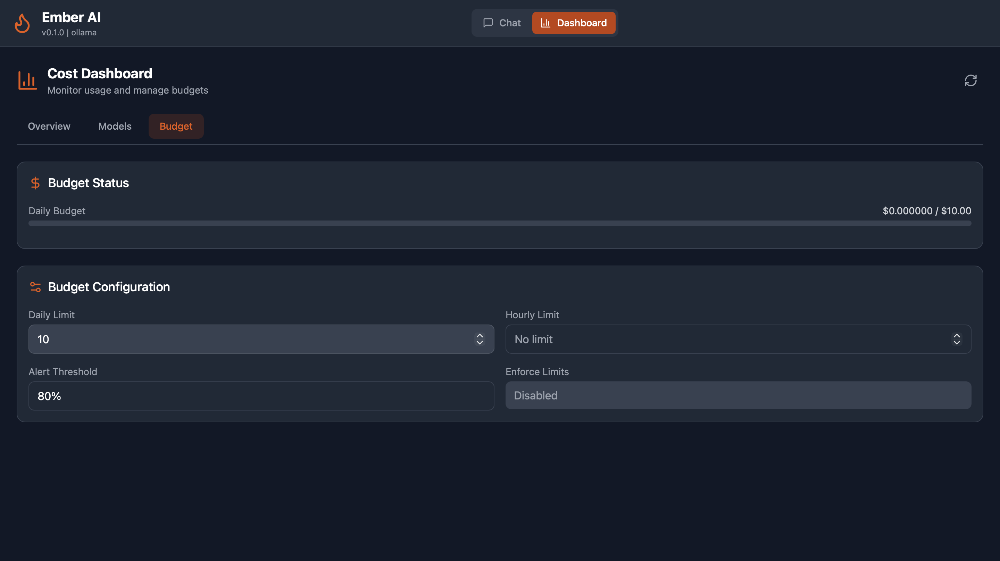
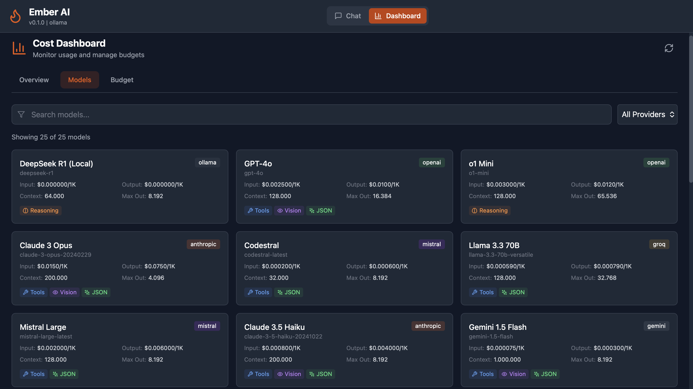

# Ember Press Kit

Official press kit for Ember - The AI Agent Framework.

---

## About Ember

Ember is an open-source AI agent framework written in Rust that provides a unified interface for building intelligent agents with 9+ LLM providers.

### One-Liner
> Ember: Build powerful AI agents in Rust with one unified API for every LLM provider.

### Short Description (50 words)
Ember is an open-source AI agent framework that unifies 9+ LLM providers (OpenAI, Anthropic, Google, Ollama, etc.) under a single Rust API. Build agents with tool execution, memory management, RAG, and plugins. Fast, safe, and extensible.

### Long Description (150 words)
Ember is a powerful open-source AI agent framework written in Rust, designed to simplify building intelligent agents across multiple LLM providers. With a single unified API, developers can seamlessly switch between OpenAI, Anthropic, Google Gemini, Ollama, Groq, DeepSeek, Mistral, OpenRouter, and xAI without changing their code.

Key features include:
- **Tool Execution**: Shell commands, filesystem operations, web requests, browser automation
- **Memory Management**: Sliding window, summary, and long-term memory
- **RAG**: Built-in vector storage and retrieval-augmented generation
- **Plugin System**: Extensible architecture with hot-reloading
- **Cost Tracking**: Real-time budget management and usage monitoring
- **Multi-Interface**: CLI, TUI, Web UI, VS Code extension, and Desktop app

Built with Rust's performance and safety guarantees, Ember is ideal for developers building production-grade AI applications that need speed, reliability, and flexibility.

---

## Key Statistics

| Metric | Value |
|--------|-------|
| LLM Providers | 9+ |
| Built-in Tools | 6 |
| Supported Languages | 6 (i18n) |
| License | Apache 2.0 / MIT |
| Language | Rust |

---

## Logo Assets

### Primary Logo
- **SVG (Vector)**: [assets/logo.svg](../assets/logo.svg)
- **Usage**: Prefer SVG for web and print

### Logo Guidelines

#### Do:
- ✅ Use the official logo files
- ✅ Maintain aspect ratio
- ✅ Use on contrasting backgrounds
- ✅ Include clear space around the logo

#### Don't:
- ❌ Stretch or distort
- ❌ Change colors
- ❌ Add effects (shadows, gradients)
- ❌ Place on busy backgrounds

### Brand Colors

| Color | Hex | Usage |
|-------|-----|-------|
| Ember Orange | `#FF6B35` | Primary brand color |
| Ember Red | `#E63946` | Accent, CTAs |
| Dark Gray | `#1A1A2E` | Text, backgrounds |
| Light Gray | `#F5F5F5` | Backgrounds |
| White | `#FFFFFF` | Text on dark |

---

## Screenshots

### CLI


### Web UI Dashboard


### Budget Tracking


### Model Selection


---

## Feature Highlights

### 🔥 Multi-Provider Support
One API, 9+ providers. Switch between OpenAI, Anthropic, and local models instantly.

### 🛠️ Powerful Tools
Built-in tools for shell, filesystem, web, and browser automation.

### 🧠 Smart Memory
Context management with sliding window and summary memory.

### 🔌 Plugin Ecosystem
Extend functionality with community plugins.

### 💰 Cost Control
Real-time budget tracking and cost prediction.

### 🚀 Rust Performance
Memory-safe, fast, and efficient.

---

## Target Audience

### Primary
- **Developers** building AI-powered applications
- **DevOps/SRE** automating workflows with AI
- **Researchers** experimenting with multiple models

### Secondary
- **Enterprises** needing multi-provider flexibility
- **Startups** building AI products
- **Hobbyists** exploring AI agents

---

## Use Cases

1. **AI Assistants** - Build custom AI assistants for code, writing, research
2. **Automation** - Automate repetitive tasks with natural language
3. **Code Generation** - Generate and review code with tool access
4. **Data Analysis** - Analyze files and data with AI
5. **DevOps** - AI-powered infrastructure management
6. **Research** - Compare outputs across multiple models

---

## Comparison

| Feature | Ember | LangChain | AutoGen | CrewAI |
|---------|-------|-----------|---------|--------|
| Language | Rust | Python | Python | Python |
| Providers | 9+ | Many | Few | Few |
| CLI/TUI | ✅ | ❌ | ❌ | ❌ |
| Web UI | ✅ | ❌ | ❌ | ❌ |
| VS Code | ✅ | ❌ | ❌ | ❌ |
| Desktop | ✅ | ❌ | ❌ | ❌ |
| Cost Tracking | ✅ | ❌ | ❌ | ❌ |
| Memory Safety | ✅ | ❌ | ❌ | ❌ |

---

## Quotes

### From Maintainers
> "Ember brings Rust's safety and performance to AI agents, making it possible to build production-grade applications that are both fast and reliable."

### Community Testimonials
*(Placeholder for real testimonials)*

> "Switching from Python to Ember improved our agent's response time by 5x while reducing memory usage."
> — *Developer Testimonial*

---

## Media Mentions

*(Placeholder for press coverage)*

- Publication Name - "Article Title"
- Publication Name - "Article Title"

---

## Interview Topics

We're happy to discuss:

1. **Building AI Agents in Rust** - Why Rust for AI?
2. **Multi-Provider Strategy** - Benefits of provider abstraction
3. **Open Source AI Tools** - The future of AI development
4. **Cost Management** - Controlling AI spending
5. **Local vs Cloud LLMs** - Hybrid approaches
6. **Enterprise AI** - Building secure, reliable agents

---

## Contact

### General Inquiries
- Email: press@ember.dev *(Placeholder)*
- Twitter: [@EmberAI](https://twitter.com/EmberAI) *(Placeholder)*

### Technical Questions
- GitHub Discussions: [github.com/niklasmarderx/ember/discussions](https://github.com/niklasmarderx/ember/discussions)
- Discord: [discord.gg/ember-ai](https://discord.gg/ember-ai) *(Placeholder)*

---

## Quick Links

| Resource | URL |
|----------|-----|
| Website | https://ember.dev |
| Documentation | https://docs.ember.dev |
| GitHub | https://github.com/niklasmarderx/ember |
| Discord | https://discord.gg/ember-ai |
| Twitter | https://twitter.com/EmberAI |
| Crates.io | https://crates.io/crates/ember-cli |

---

## Boilerplate

### For Articles
```
Ember is an open-source AI agent framework written in Rust. 
Learn more at https://ember.dev
```

### For Social Media
```
🔥 Ember - Build powerful AI agents in Rust
✨ 9+ LLM providers, one API
🛠️ Tools, memory, RAG, plugins
📦 https://github.com/niklasmarderx/ember
```

---

## License

This press kit and Ember are released under dual Apache 2.0 and MIT licenses.

---

*Last updated: March 2026*